## Here's Futaki Haduki ☁

Hello, I'm [Futaki Haduki](https://github.com/Cloudac7)(二木葉月).

- 🇨🇳 Ph.D student of Xiamen University (2019-)
- 🇨🇳 BSc student of Xiamen University (2015-2019)
- 🔭 Currently working on computational chemistry.
- 💻 Now insterested in machine learning based molecular dynamics.
- 🌱 Also interested in ACGN. For example, Yuri manga (including Kirara).
- 🎮 Now a player of [HEAVEN BURNS RED](https://heaven-burns-red.com).
- 🌟 Fan of [Asteroid in Love (恋する小惑星)](http://koiastv.com/)

